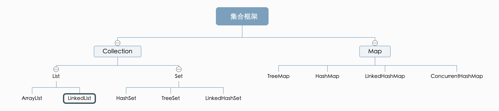
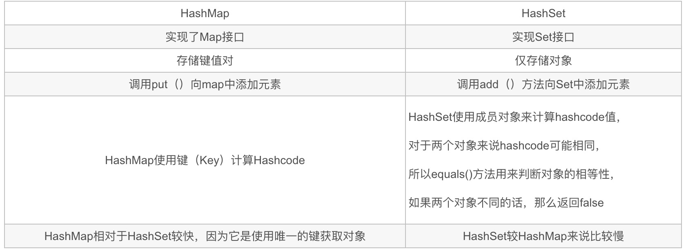

[参考自知乎用户：钢铁侠的Java笔记](https://zhuanlan.zhihu.com/p/82714518)
# Java集合整理
## 总章
### 说说常见的集合有哪些吧？
答：`Map接口`和`Collection接口`是所有集合框架的父接口：

- Collection接口的子接口包括：`Set`接口和`List`接口  
- Map接口的实现类主要有：`HashMap`、TreeMap、Hashtable、ConcurrentHashMap以及Properties等  
- Set接口的实现类主要有：HashSet、TreeSet、LinkedHashSet等  
- List接口的实现类主要有：ArrayList、LinkedList、Stack以及Vector等

### 具体实现
实现类 | 底层实现
---|---
ArrayList| 数组
LinkedList | 双向循环链表
HashSet | HashMap
TreeSet | TreeMap的SortedSet
LinkedHashSet | LinkedHashMap
HashMap | 数组 + 链表 + 红黑树
TreeMap | 二叉树

## List篇
### ArrayList和LinkedList的区别？
- LinkedList 实现了 List 和 Deque 接口，一般称为双向链表；ArrayList 实现了 List 接口，动态数组；
- LinkedList 在插入和删除数据时效率更高，ArrayList 在查找某个 index 的数据时效率更高；
- LinkedList 比 ArrayList 需要更多的内存；
#### Array 和 ArrayList 有什么区别？什么时候该应 Array 而不是 ArrayList 呢？
- Array 可以包含基本类型和对象类型，ArrayList 只能包含对象类型。
- Array 大小是固定的，ArrayList 的大小是动态变化的。
- ArrayList 提供了更多的方法和特性，比如：addAll()，removeAll()，iterator() 等等。
对于基本类型数据，集合使用自动装箱来减少编码工作量。但是，当处理固定大小的基本数据类型的时候，这种方式相对比较慢。
因此，针对于基本数据类型，使用Array。

## Set篇
### Java集合的快速失败机制 “fail-fast”？
是java集合的一种错误检测机制，当多个线程对集合进行结构上的改变的操作时，有可能会产生 fail-fast 机制。  
例如：假设存在两个线程（线程1、线程2），线程1通过Iterator在遍历集合A中的元素，在某个时候线程2修改了集合A的结构（是结构上面的修改，而不是简单的修改集合元素的内容），那么这个时候程序就会抛出 ConcurrentModificationException 异常，从而产生fail-fast机制。
> 扫盲：迭代器在遍历时直接访问集合中的内容，并且在遍历过程中使用一个 modCount 变量。集合在被遍历期间如果内容发生变化，就会改变modCount的值。每当迭代器使用hashNext()/next()遍历下一个元素之前，都会检测modCount变量是否为expectedmodCount值，是的话就返回遍历；否则抛出异常，终止遍历。
#### 解决方案：
关键还是多线程并发访问，因此有两种方式：
1， 在遍历过程中，所有涉及到改变的modCount值的地方全部加上synchronize
2， 使用线程安全类copyOnWriteArrayList来替换ArayList

## Map篇
### HashMap与HashTable的区别？
- HashMap没有考虑同步，是线程不安全的；Hashtable使用了synchronized关键字，是线程安全的；
- HashMap允许K/V都为null；后者K/V都不允许为null；
- HashMap继承自AbstractMap类；而Hashtable继承自Dictionary类；
### HashMap和HashSet有什么区别

### 如果HashMap的key是一个自定义的类，怎么办？
重写hashcode()和euqlas()方法。
###  HashMap是怎么解决哈希冲突的？
1. 使用链地址法（使用散列表）来链接拥有相同hash值的数据；  
2. 使用2次扰动函数（hash函数）来降低哈希冲突的概率，使得数据分布更平均；  
3. 引入红黑树进一步降低遍历的时间复杂度，使得遍历更快；
### ConcurrentHashMap和Hashtable的区别？
ConcurrentHashMap 结合了 HashMap 和 HashTable 二者的优势。HashMap 没有考虑同步，HashTable 考虑了同步的问题。但是 HashTable 在每次同步执行时都要锁住整个结构。ConcurrentHashMap 锁的方式是稍微细粒度的。
####   ConcurrentHashMap的具体实现知道吗？
### HashSet是如何保证数据不可重复的？
HashSet的底层其实就是HashMap，只不过我们HashSet是实现了Set接口并且把数据作为K值，而V值一直使用一个相同的虚值来保存，我们可以看到源码：
```
public boolean add(E e){
    return map.put(e, PRESENT)==null;    
}

``` 
由于HashMap的K值本身就不允许重复，并且在HashMap中如果K/V相同时，会用新的V覆盖掉旧的V，然后返回旧的V，那么在HashSet中执行这一句话始终会返回一个false，导致插入失败，这样就保证了数据的不可重复性；
#### 能否说的在详细点呢？
首先通过元素的hashcode方法来获取哈希值。首先判断两个元素的哈希值，如果哈希值一样，接着会比较
euqals方法。如果equals方法结果为true，HashSet就视为同一个元素。如果equals为false就不是同一个元素。

## 扩展问题
### BlockingQueue是什么？
Java.util.concurrent.BlockingQueue是一个队列，在进行检索或移除一个元素的时候，它会等待队列变为非空；当在添加一个元素时，它会等待队列中的可用空间。BlockingQueue接口是Java集合框架的一部分，主要用于实现生产者-消费者模式。我们不需要担心等待生产者有可用的空间，或消费者有可用的对象，因为它都在BlockingQueue的实现类中被处理了。Java提供了集中BlockingQueue的实现，比如ArrayBlockingQueue、LinkedBlockingQueue、PriorityBlockingQueue,、SynchronousQueue等。